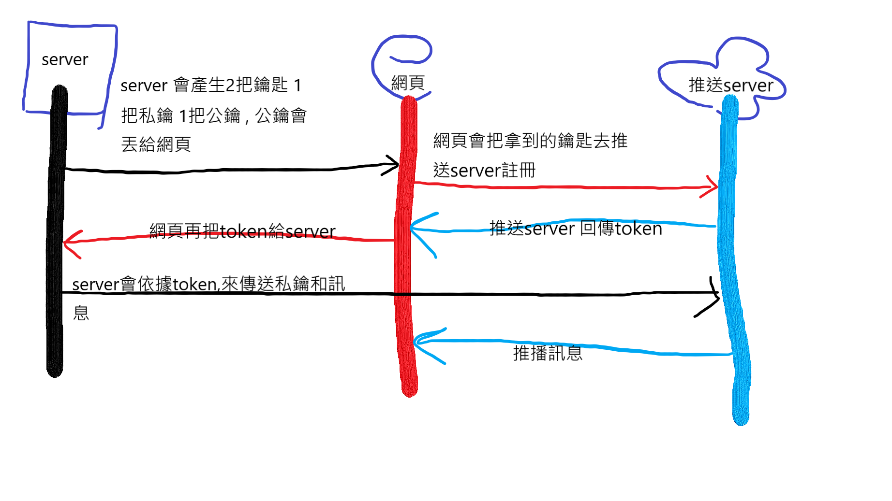

# Web Push的範例

## 流程圖

使用 [service workers API] (https://developer.mozilla.org/en-US/docs/Web/API/Service_Worker_API) 來發送推播通知
[registration.pushManager.subscribe()](https://developer.mozilla.org/en-US/docs/Web/API/PushManager/subscribe)

web-push的模組 類似: [pywebpush] (https://github.com/web-push-libs/pywebpush) 可以省掉 PubNub 之類的中間溝通,直接推送訊息

要設定 web 推送,必須先建立 VAPID keys(VAPID keys 用來辨識是誰發送了推送消息)
npm 的 web-push 模组能夠產生 VAPID keys (指令: ./node_modules/.bin/web-push generate-vapid-keys)

server.js: 使用 web-push 模组,並且把剛才的 VAPID keys 存放在 PUBLIC_VAPID_KEY 和 PRIVATE_VAPID_KEY 環境變數裡面

client.js: 初始化你的 service worker 並且向server 發送/subscribe 請求

worker.js: client.js 所使用的 worker.js, 這是 service worker 的程式邏輯 當訂閱者接受到一個推送訊息時,service worker 將收到一個 push 事件

